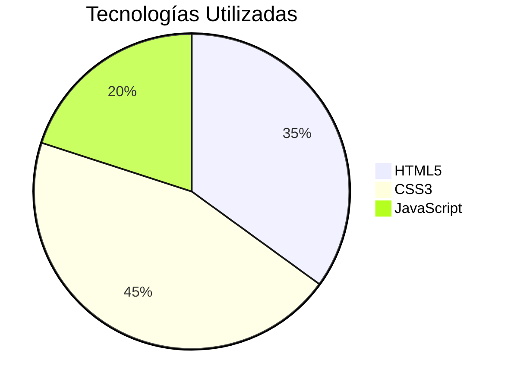

# 📝 Formulario de Encuesta 

## 🌟 Descripción
Este proyecto se desarrolla como actividad de la Escuela Pública de Código del Gobierno de México.
Formulario web interactivo desarrollado con HTML, CSS y JavaScript que permite recopilar:
- Información personal
- Preferencias tecnológicas
- Comentarios de usuarios

## 🎨 Características
| Sección | Tecnologías | Interactividad |
|---------|------------|----------------|
| Datos personales | HTML5 semántico | Validación en tiempo real |
| Preguntas múltiples | CSS Flexbox | Efectos hover |
| Comentarios | CSS Variables | Animaciones |
| - | JavaScript | Confeti al enviar |

## 🛠 Stack Tecnológico


## 📂 Estructura
```
formulario/
├── index.html
├── styles.css
└── README.md
```


